LSDR - Learning the Sweet-spot Distribution Range
==================================

This repository contains the code for [Learning Domain Randomization Distributions for Training Robust Locomotion Policies](https://arxiv.org/abs/1906.00410) paper and is built on top of the PPO implementation from OpenAI's [spinningup.openai.com](https://spinningup.openai.com) code.

## Getting Started
Implemented and tested on Ubuntu 16.04 with Python 3.6, Tensorflow 1.14.0 and torch 1.1.0 (note that we use torch for the distribution learning part).

1. Follow the instructions on the `spinningup` repo to install the dependencies. Note that current implementation does not utilize `mpi` but this dependency was embedded in the original implementation and can be easily removed.

```
sudo apt-get update && sudo apt-get install libopenmpi-dev
```

2. Clone this repo and install :
```
git clone https://github.com/openai/spinningup.git
cd spinningup
pip install -e .
```

## Select Experiment Config
You can configure each experiments via the `.json` config file under `configs/`. There are two sets of config files, one describing the algorithm you want to run, described by `train_ph` - for example `DR_FIXED` means the domain randomization distribution will be kept fixed and `DR_LEARNED` means the distribution will be learned. The field `train_family` describes the type of distribution you choose, this can be `gaussian` or `discrete`. You can then specify the values for the initial distribution inside `train_dist` field. You can also play around and mix-and-match different types of distributions, for instance, if you select `gaussian` training distribution, your test distribution can be `discrete` etc.
You can train an agent with a single context being randomized, or multi-context. You can specify this through the field `env`. For example, `hopper-torso-only` means only torso size context is being randomized, whereas `hopper` means all 3 contexts are being randomized. It is best to consult the file `env/environment_sampler.py` as all the supported environments with corresponding name are listed there. You also need to make sure the initial selected distribution matches the number of contexts that you select, for example a single context experiment is just a gaussian distribution, whereas multi-context, is a multivariate gaussian distribution requiring `3` initial mean and standard deviation.

The second set of configs are located under `configs/train_settings/` dir. This is the config used to change network parameters, epochs etc. For example, `configs/train_settings/train_ctx_configs.json` trains a context conditioned policy (`cat_context:True`), and  to change network parameters, epochs etc. For example, `configs/train_settings/train_no_ctx_configs.json` trains w/o contexts being appended. You can also experiment with other parameters such as `reward normalization`, `context_normalization`, `importance sampling` etc.

## Training
To reproduce the results below are examples of commands to run the experiment.

### Hopper Torso Discrete Distribution Learning
`python lsdr/algorithm/ppo/experiment_runner.py --experiments_config configs/Hopper_torso_only_discrete.json --train_only --data_dir experiment_data --ctx_config configs/train_settings/train_ctx_discrete.json  --cpu_cores 1`

### Hopper multi-dimensional context Learning
`python lsdr/algorithm/ppo/experiment_runner.py --experiments_config configs/Hopper_multi_ctx_Learn.json --train_only --data_dir experiment_data --ctx_config configs/train_settings/train_ctx_gaussian.json  --cpu_cores 1`

### Half-Cheetah multi-dimensional context Learning
`python lsdr/algorithm/ppo/experiment_runner.py --experiments_config configs/HalfCheetah_multi_ctx.json --train_only --data_dir experiment_data --ctx_config configs/train_settings/train_ctx_gaussian.json  --cpu_cores 1`

As a santiy check, you can check under the experiments folder to find the corresponding `config.json` to double check all the selected parameters (this is in the lower level directory of training experiments).

## Plotting the Results

To plot the learned distributions for either discrete or gaussian, you can use the `plot.py` script, providing the path to the experiment, where the path includes the top level experiment directory name, followed by the top level experiment directory name. This will plot the learning curves and the distribution.

```
python lsdr/utils/plot.py --style separate experiment-data-folder/top-level-exp-dir/
```

You can also visualize reward per context plot.
```
python lsdr/utils/plot.py --style reward-per-ctx experiment-data-folder/top-level-exp-dir/
```

All the results will be under the lower level experiment directory.

## Hopper Discrete Distribution Learning

<p style="text-align:center;">
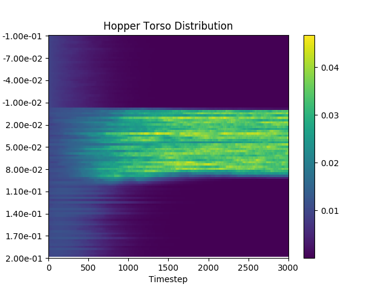

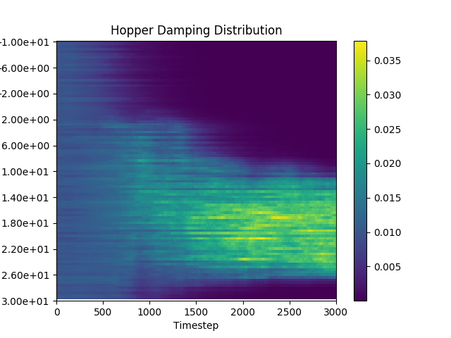

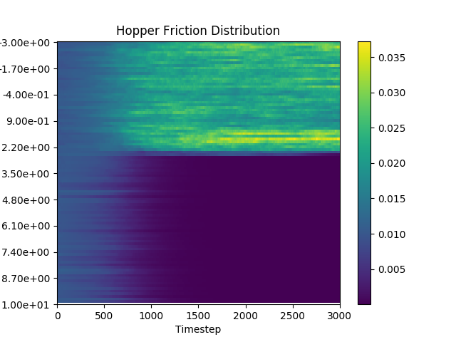

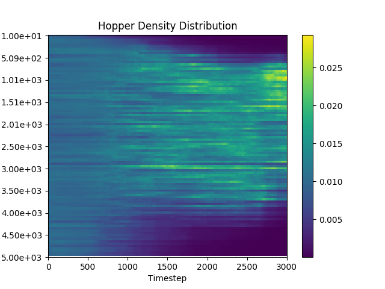
</p>

## Hopper Multivariate Gaussian Distribution Learning

<p style="text-align:center;">
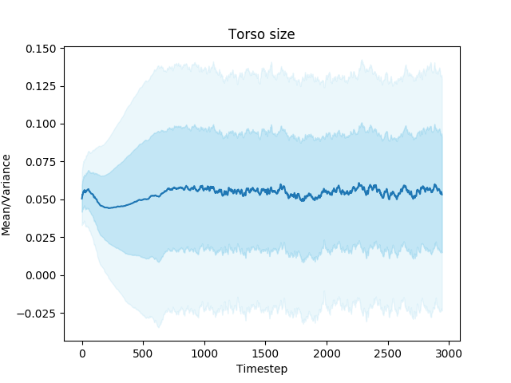

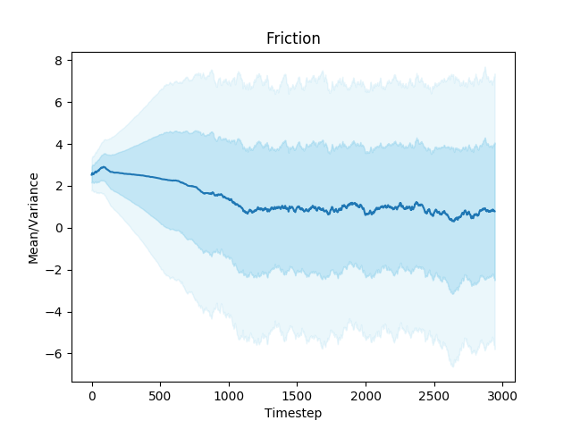

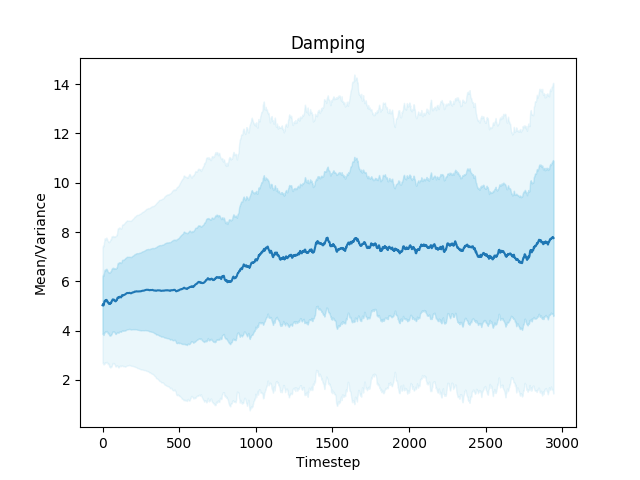
</p>

## Half-Cheetah Discrete Distribution Learning

<p style="text-align:center;">
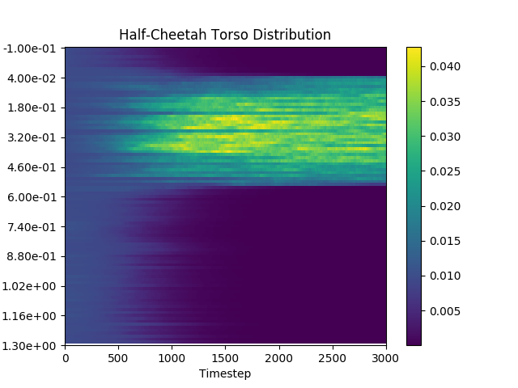

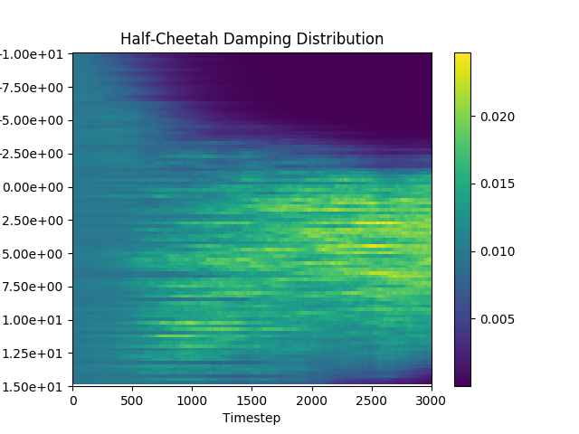

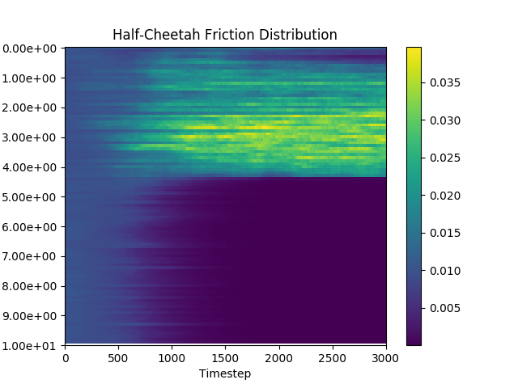

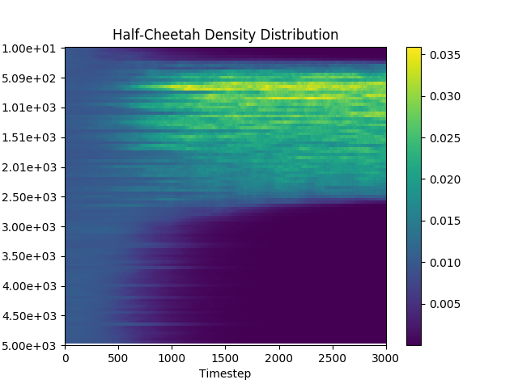
</p>

## Half-Cheetah Multivariate Gaussian Distribution Learning

<p style="text-align:center;">
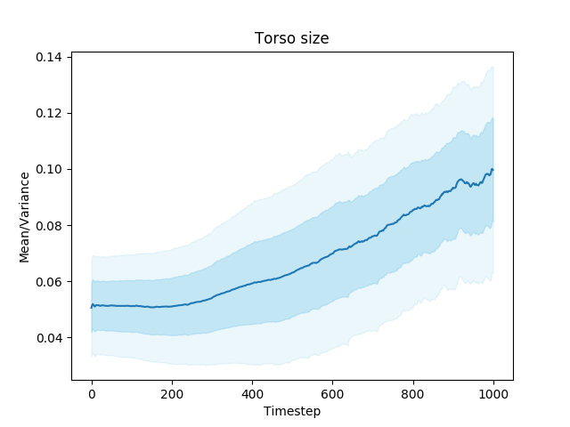

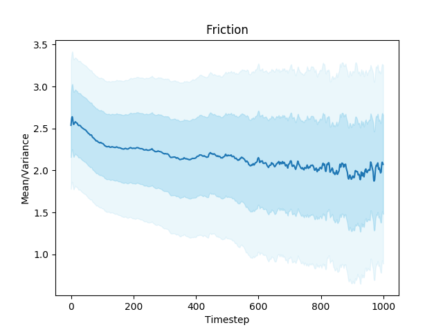

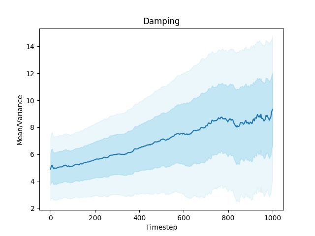
</p>

## Testing Generalization
You need to run the same script as above, by passing it the same config you used during training, and the flag `--skip_train` option. This launches processes per seed, and typically runs faster using `cpu`. This tests the generalization and robustness of the final policies. You can choose to test the policy on the full test range (accepting that many sampled contexts will not be solvable) or alternatively use the final learned distribution which will hopefully contain solvable contexts only or some other distribution of your own choosing.

`python lsdr/algorithm/ppo/experiment_runner.py --experiments_config configs/Hopper_multi_ctx_Learn.json --skip_train --cpu --data_dir experiment_data --ctx_config configs/train_settings/train_ctx_configs.json --test_seeds 50`

## Code Navigation
The main algorithm code are under the following directories:
- `lsdr/algorithm/ppo/`

These include the modifications to the `ppo` algorithm and the algorithm procedure can be found inside `ppo.py` and `ppo_transfer.py`.

The modified mujoco environments used :
- `lsdr/envs/`


Implementation of the distributions:
- `lsdr/envs/environment_sampler.py`

